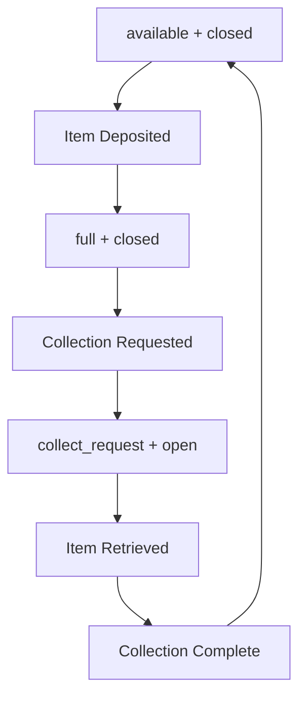

# Box Guide - FINDR System Hardware Management

This guide covers box management, status workflows, collection processes, and hardware integration for the FINDR Smart Lost & Found system.

## 📦 Box Overview

FINDR boxes are smart hardware units that store lost items securely. Each box has:
- **Capacity**: Currently 1 item per box (simplified design)
- **RFID Reader**: For authentication during collection
- **Door Mechanism**: Automated locking/unlocking
- **Camera**: For item verification (future enhancement)
- **Network Connection**: WiFi/Ethernet for API communication

## 🔄 Box Status System

The system uses **two separate status fields** for comprehensive box management:

### 1. Box Status (Logical State)

Controls the operational workflow and determines when actions should occur.

| Status | Description | Next Actions |
|--------|-------------|--------------|
| `available` | Ready to receive items | Accept new items |
| `full` | At capacity (1 item) | Request collection |
| `collect_request` | Requesting collection | Open door for pickup |
| `maintenance` | Under maintenance | Admin intervention needed |
| `offline` | Not operational | Technical support required |

### 2. Door Status (Physical State)

Controls the actual door mechanism independently of workflow status.

| Door Status | Description | Hardware State |
|-------------|-------------|----------------|
| `closed` | Door locked and closed | Safe, secure storage |
| `open` | Door unlocked and open | Allow item access |

## 🎯 Box Workflow States

### Normal Operation Flow



**State Transitions:**

1. **Initial State**: `available` + `closed`
   - Box ready for new items
   - Door locked for security

2. **Item Deposited**: `full` + `closed`
   - System detects item presence
   - Box now at capacity (1 item)

3. **Collection Requested**: `collect_request` + `open`
   - Automatic transition when full
   - Door opens for item retrieval
   - LED/display shows "Ready for Collection"

4. **Collection Complete**: `available` + `closed`
   - Item retrieved by owner
   - Box resets to initial state

## 🔐 Collection Process

### Automatic Collection Flow

1. **Box becomes full** → Status changes to `collect_request`
2. **Door opens automatically** → Door status becomes `open`
3. **User presents RFID card** → System validates ownership
4. **Item retrieved** → User removes item
5. **Collection confirmed** → Status resets to `available` + `closed`

### Manual Collection Override

```bash
# Force open door for specific box
curl -X POST http://localhost:5000/box/box_001/door/open

# Manually mark collection complete
curl -X POST http://localhost:5000/box/box_001/collection_complete
```

## 🔧 Box Management APIs

### Registration and Setup

```bash
# Register a new box
curl -X POST http://localhost:5000/box/register \
  -H "Content-Type: application/json" \
  -d '{
    "box_id": "box_001",
    "capacity": 1,
    "status": "available"
  }'
```

### Status Monitoring

```bash
# Get current box status
curl http://localhost:5000/box/box_001/status

# Get all boxes overview
curl http://localhost:5000/boxes
```

### Manual Control

```bash
# Update box status
curl -X POST http://localhost:5000/box/box_001/status \
  -H "Content-Type: application/json" \
  -d '{
    "status": "maintenance",
    "door_status": "closed"
  }'

# Open door manually
curl -X POST http://localhost:5000/box/box_001/door/open

# Close door manually  
curl -X POST http://localhost:5000/box/box_001/door/close
```

## 🛠️ Hardware Integration

### ESP32 Integration

The FINDR boxes use ESP32 microcontrollers for hardware control:

**Main Functions:**
- WiFi connectivity for API communication
- RFID reader management
- Door servo/solenoid control
- Status LED indicators
- Sensor monitoring (door position, item presence)

**Key Hardware Files:**
- `hardware/CameraWebServer.ino` - Main Arduino sketch
- `hardware/camera_pins.h` - Pin configuration
- `hardware/board_config.h` - Board-specific settings

### Hardware API Communication

**Box → Backend Communication:**
```cpp
// ESP32 code example
void updateBoxStatus(String status, String doorStatus) {
    HTTPClient http;
    http.begin("http://backend:5000/box/" + BOX_ID + "/status");
    http.addHeader("Content-Type", "application/json");
    
    String payload = "{\"status\":\"" + status + "\",\"door_status\":\"" + doorStatus + "\"}";
    int httpCode = http.POST(payload);
    
    if(httpCode == 200) {
        Serial.println("Status updated successfully");
    }
    http.end();
}
```

**Backend → Box Communication:**
```cpp
// ESP32 receives commands via HTTP endpoints
void handleDoorOpen() {
    servo.write(90); // Open position
    updateBoxStatus("collect_request", "open");
}

void handleDoorClose() {
    servo.write(0); // Closed position  
    updateBoxStatus("available", "closed");
}
```

### RFID Integration

**RFID Authentication Flow:**
1. User presents RFID card to reader
2. ESP32 reads card ID
3. ESP32 sends RFID to backend for validation
4. Backend checks user permissions
5. If valid, backend commands door to open

```cpp
// RFID reading example
void checkRFID() {
    if (mfrc522.PICC_IsNewCardPresent()) {
        String cardID = getCardID();
        
        // Send to backend for validation
        HTTPClient http;
        http.begin("http://backend:5000/finder/rfid/" + cardID);
        int httpCode = http.GET();
        
        if(httpCode == 200) {
            String response = http.getString();
            // Parse response and open door if authorized
            if(response.indexOf("authorized") > 0) {
                openDoor();
            }
        }
    }
}
```

## 📊 Box Status Monitoring

### Real-time Status Dashboard

Monitor all boxes in the system:

```bash
# Get comprehensive box information
curl http://localhost:5000/boxes
```

**Response includes:**
- Box ID and location
- Current status and door state
- Item count and capacity
- Last update timestamp
- Collection queue status

### Status Validation Rules

**Box Status Validation:**
```python
def validate_box_status(status):
    valid_statuses = {
        "available", "full", "collect_request", 
        "maintenance", "offline"
    }
    return status in valid_statuses

def validate_door_status(door_status):
    valid_door_statuses = {"closed", "open"}
    return door_status in valid_door_statuses
```

**Automatic Status Updates:**
- **Item Added**: `available` → `full` (when item deposited)
- **Collection Needed**: `full` → `collect_request` (automatic)
- **Collection Complete**: `collect_request` → `available` (after item retrieved)

### Error States and Recovery

**Common Error Scenarios:**

1. **Door Stuck Open:**
   ```bash
   # Force close door
   curl -X POST http://localhost:5000/box/box_001/door/close
   
   # Set maintenance mode if hardware issue
   curl -X POST http://localhost:5000/box/box_001/status \
     -d '{"status": "maintenance"}'
   ```

2. **Box Offline:**
   ```bash
   # Check box connectivity
   ping box_001_ip_address
   
   # Mark as offline in system
   curl -X POST http://localhost:5000/box/box_001/status \
     -d '{"status": "offline"}'
   ```

3. **RFID Reader Failure:**
   - Use manual override codes
   - Check hardware connections
   - Replace RFID module if needed

## 🔍 Troubleshooting Guide

### Common Issues

**Box Not Responding:**
1. Check network connectivity
2. Verify power supply
3. Reset ESP32 if needed
4. Check backend API availability

**Door Won't Open:**
1. Check servo/solenoid connections
2. Verify power supply to door mechanism
3. Test manual door control API
4. Check for physical obstructions

**RFID Not Working:**
1. Verify RFID module connections
2. Check card registration in database
3. Test RFID reader with known good cards
4. Check backend RFID validation endpoint

**Status Sync Issues:**
1. Verify API endpoints are reachable
2. Check database connectivity
3. Review status update logs
4. Manually sync box status if needed

### Diagnostic Commands

```bash
# Test box connectivity
curl -f http://localhost:5000/box/box_001/status || echo "Box offline"

# Reset box to known good state
curl -X POST http://localhost:5000/box/box_001/collection_complete

# Check for items in box
curl http://localhost:5000/box/box_001/items

# View system-wide box health
curl http://localhost:5000/boxes | jq '.boxes[] | select(.status != "available")'
```

## 🏗️ Box Deployment

### Network Configuration

**Requirements:**
- Stable WiFi/Ethernet connection
- Access to backend API server
- Static IP address recommended
- Firewall rules for API communication

**ESP32 Network Setup:**
```cpp
// WiFi configuration
const char* ssid = "FINDR_Network";
const char* password = "your_wifi_password"; 
const char* backend_url = "http://192.168.1.100:5000";
```

### Physical Installation

1. **Mounting**: Secure box to wall or pedestal
2. **Power**: Connect to reliable power source
3. **Network**: Configure WiFi credentials
4. **Testing**: Verify all functions before deployment
5. **Registration**: Register box in system database

### Configuration Files

**Box Configuration (`config.json`):**
```json
{
  "box_id": "box_001",
  "location": "Library Entrance",
  "capacity": 1,
  "rfid_enabled": true,
  "auto_collection": true,
  "backend_url": "http://backend.findr.local:5000"
}
```

## 📈 Performance Optimization

### Response Time Optimization

- **Local Caching**: Cache box status locally
- **Async Updates**: Use background status updates
- **Connection Pooling**: Maintain persistent connections
- **Batch Operations**: Group multiple status updates

### Hardware Optimization

- **Power Management**: Implement sleep modes
- **Memory Usage**: Optimize ESP32 memory usage
- **Network Efficiency**: Minimize API calls
- **Error Recovery**: Implement automatic recovery mechanisms

## 🔮 Future Enhancements

### Planned Features

1. **Camera Integration**: Visual item verification
2. **Weight Sensors**: Automatic item detection
3. **Multi-item Boxes**: Support for larger capacity boxes
4. **Mobile App**: Direct box interaction via smartphone
5. **IoT Dashboard**: Real-time monitoring interface

### Hardware Upgrades

- **Improved RFID**: Longer range readers
- **Better Locks**: More secure locking mechanisms
- **Solar Power**: Self-sustaining power options
- **Tamper Detection**: Security sensors and alerts

---

## 📚 Related Documentation

- **[API Guide](api-guide.md)**: Complete API reference for box endpoints
- **[Database Guide](database-guide.md)**: Box data storage and management
- **[Testing Guide](testing-guide.md)**: Box functionality testing procedures

For hardware schematics and detailed technical specifications, see `docs/FINDR_schematic_diagram.jpg` and the `hardware/` directory.