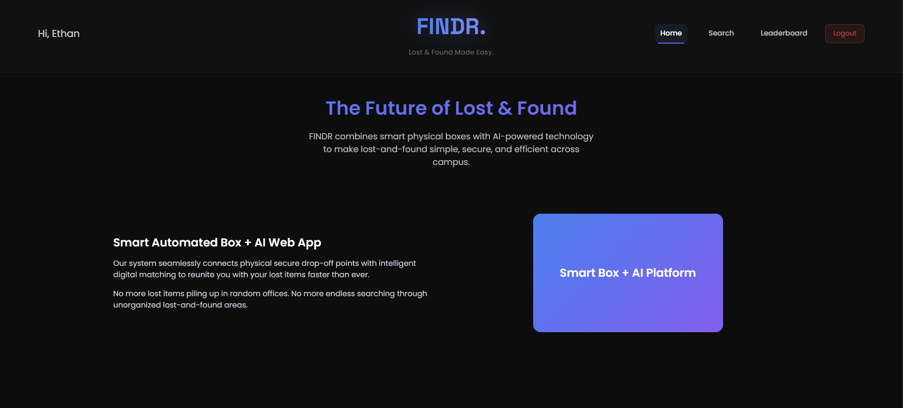
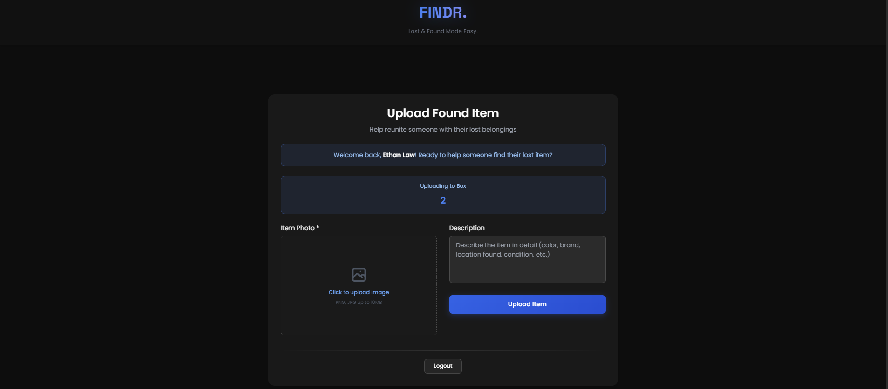
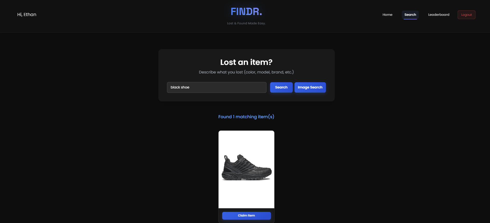
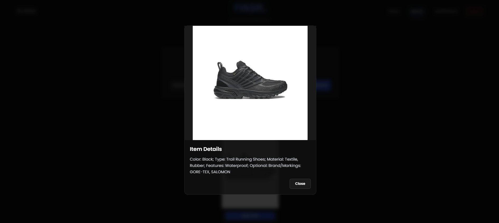
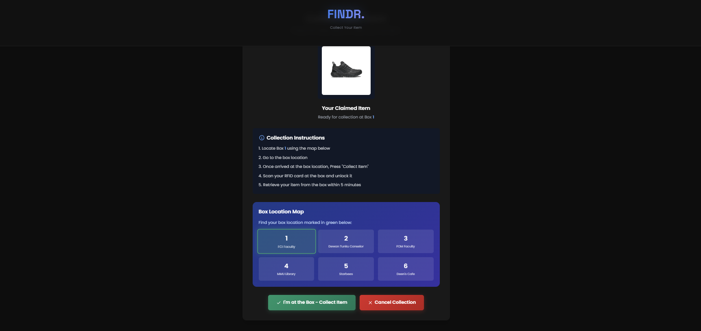
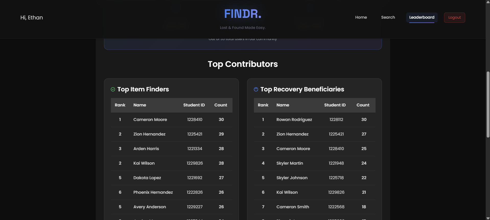
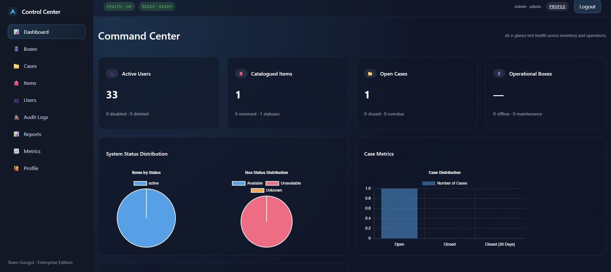
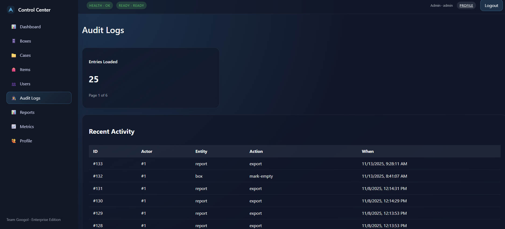

# FINDR. - Lost & Found Made Easy 
## (3rd Place Winner, Hardware Track, CodeNection MMU 2025)

FINDR is a smart automated box + AI-powered web app that simplifies the lost-and-found process on university campuses. Users can deposit found items securely and owners can search, match, and retrieve their belongings through an AI-driven system with RFID-based authentication.

## 🚀 Key Features

- 📷 Accessibility – Easy item drop off and easy item search anytime, anywhere
- 🤖 AI Matching – Lost item descriptions are matched with stored items using CLIP embeddings + LLM (Gemini 2.5 Flash).
- 🔐 24/7 Secure Retrieval – RFID card authentication ensures only the rightful owner can unlock the box.
- 💡 Centralized Admin Panel - Able to control and manage multiple FINDR boxes with just a centralized admin panel
- 📊 Transparency – Snapshots and logs track every deposit and retrieval.
- 🌍 Scalability – Multiple FINDR boxes can be deployed across campus, making it very accessible for students to drop-off/collect anywhere
- 🛠️ Modular Design – Easy to maintain and upgrade with modular hardware components.


## 🛠️ Hardware Components used in the final prototype

- ESP32-CAM - Captures images and handles communication with the server.
- LCD Display (LCD1) - Displays QR code for user login and shows the status of the box.
- PCF8575 I/O - Provides 16 additional GPIO pins to the ESP32 via I2C for connecting to low-speed devices.
- IR Sensor - Detects presence or movement of a person in front of the box.
- RFID Sensor - Allows users to unlock the box using their student card.
- Switch Sensor - Detects whether the box is open or closed.
- DC-DC Step-Down Converter - Provides regulated power supply to the entire circuit.

## 📺 Prototype Video
[](https://youtu.be/-d-M06xUAgM)

## 📑 Prototype Slides
[View the full report (PDF)](./docs/Team_Googol_Slides.pdf)

## Finalist Presentation Slides
[View the finalist presentation slides (PDF)](./docs/Final_Presentation_FINDR.pdf)

## Final Demo Video
[](https://youtu.be/GA4SrxnzHnM)

## Screenshots

Below are a few screenshots from the web app (click to view full size):

- Home page

   

- Upload page

   

- Search page (examples)

   

   

- Collect page

   

- Leaderboard

   

- Admin panel (examples)

   

   


## Quick Start

- Python Version : Python 3.10.12

1. **Setup Environment:**
   ```bash
   source .venv/bin/activate
   pip install -r requirements.txt
   ```

2. **Start App:**
 ```
 	uvicorn app.main:app --reload --port 8000
   ```

3. **Access the Web App:**
   Open your browser and navigate to `http://localhost:8000`
   To go to upload page directly, go to `http://localhost:8000/upload`

## Documentation

- Check out documentation.txt for more information on software API

## Presentation Deck

- **[Flow Chart](https://www.mermaidchart.com/app/projects/dd0eea15-bc63-4a02-a0c7-3440051f175d/diagrams/5ef3004c-5b21-40b7-9589-12ee9d861a6f/version/v0.1/edit)** - Complete System Flow Chart

- **[Item upload and query pipeline](https://www.mermaidchart.com/app/projects/a605fc72-a4c5-45d0-abd0-827c4456da58/diagrams/9ac1802e-2a3a-4f5b-bafa-9e888fa3b06f/version/v0.1/edit)** - How we implement AI in image processing/query

- **[Schematic Diagram](docs/FINDR_schematic_diagram.jpg)** - Schematic Diagram for this diagram