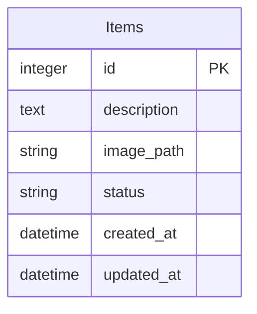
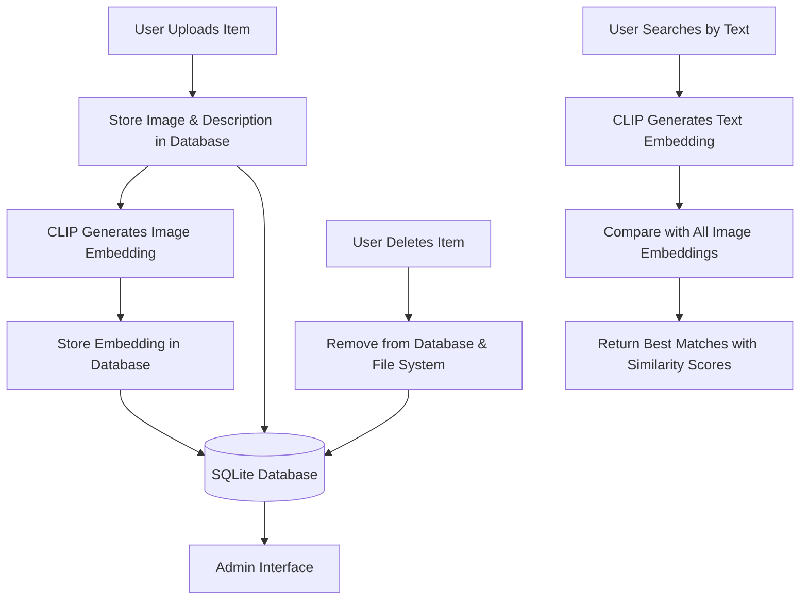

# Lost & Found System Architecture

## System Overview
This document describes the clean and simple architecture of the Lost & Found System using CLIP AI for intelligent item matching. The Ethan project follows this streamlined workflow.

## Entity Relationship Diagram



## System Flow Diagram



## API Architecture

```mtml:mermaid
graph TB
    subgraph "Frontend (HTML/JS)"
        UI[User Interface]
        Upload[Upload Form]
        Search[Search Interface]
        Gallery[Items Gallery]
    end
    
    subgraph "Backend (Flask)"
        UploadAPI[/upload - POST]
        SearchAPI[/search - GET]
        DeleteAPI[/delete - DELETE]
    end
    
    subgraph "AI Layer"
        CLIP[OpenAI CLIP Model]
        Embeddings[Image/Text Embeddings]
    end
    
    subgraph "Data Layer"
        DB[(SQLite Database)]
        Files[File Storage /uploads]
    end
    
    Upload --> UploadAPI
    Search --> SearchAPI
    Gallery --> DeleteAPI
    
    UploadAPI --> CLIP
    SearchAPI --> CLIP
    
    CLIP --> Embeddings
    Embeddings --> DB
    
    UploadAPI --> DB
    SearchAPI --> DB
    DeleteAPI --> DB
    UploadAPI --> Files
```

## Key Features

### 1. Intelligent Matching
- **CLIP AI Integration**: Uses OpenAI's CLIP model for visual-semantic understanding
- **Text-to-Image Search**: Natural language descriptions match with item images
- **Confidence Scoring**: Provides similarity scores for match quality (0.0-1.0)
- **Multi-modal Search**: Combines text queries with visual embeddings

### 2. Simple Item Management
- **Upload**: Users can upload images with descriptions
- **Search**: Text-based search across all items
- **Delete**: Remove items from the system
- **Gallery View**: Browse all available items

### 3. Clean Architecture
- **Single Database Table**: Simplified data model with one Items table
- **RESTful API**: Clean endpoints for upload, search, and delete
- **File Management**: Automatic image storage and cleanup
- **Real-time Search**: Instant results with similarity scoring

## Data Flow

### Item Upload Process
1. User uploads image with description via frontend form
2. Backend receives image and stores it in `/uploads` folder
3. CLIP model generates image embedding (768-dimensional vector)
4. Item details and embedding stored in SQLite database
5. Success response returned to frontend

### Search Process
1. User enters search query in text field
2. Frontend sends GET request to `/search` endpoint
3. CLIP generates text embedding for search query
4. Backend compares text embedding with all stored image embeddings
5. Cosine similarity calculated for each comparison
6. Results sorted by similarity score (highest first)
7. Items with similarity > 0.2 threshold returned with scores

### Delete Process
1. User clicks delete button on item
2. Frontend sends DELETE request with item ID
3. Backend removes item record from database
4. Associated image file deleted from filesystem
5. Success confirmation returned

## Security & Simplicity Features

- **CORS Protection**: Configured for secure cross-origin requests
- **File Validation**: Only accepts valid image formats (JPG, PNG, WEBP)
- **Error Handling**: Comprehensive error responses with proper HTTP status codes
- **Clean Database Schema**: Single table design for simplicity
- **Automatic Cleanup**: File deletion when items are removed

## Technology Stack

### Backend
- **Framework**: Flask (Python) - Lightweight and simple
- **Database**: SQLite with SQLAlchemy ORM - File-based, no server needed
- **AI Model**: OpenAI CLIP (ViT-L/14@336px) - State-of-the-art multimodal AI
- **File Handling**: Werkzeug secure filename utilities
- **CORS**: Flask-CORS for frontend integration

### Frontend  
- **Technology**: HTML5, CSS3, JavaScript (Vanilla) - No framework complexity
- **UI Design**: Clean, responsive interface
- **API Communication**: Fetch API with proper error handling
- **File Upload**: HTML5 FormData with drag-and-drop support

### AI Integration
- **Model**: CLIP for multimodal understanding
- **Embeddings**: 768-dimensional vectors for semantic similarity
- **Similarity**: Cosine similarity scoring (0.0 to 1.0)
- **Threshold**: 0.2+ for relevant matches, 0.5+ for strong matches

## Deployment Notes

- **Development**: Run with `python app.py` from backend directory
- **Database**: Auto-created SQLite file on first run (`instance/lost_found.db`)
- **File Storage**: Local uploads folder (`uploads/`) created automatically  
- **CLIP Model**: Downloaded automatically on first use (~1.7GB)
- **CORS**: Configured for localhost development and production
- **Dependencies**: Install with `pip install -r requirements.txt`

## API Endpoints

### POST /upload
- **Purpose**: Upload new item with image and description
- **Parameters**: `image` (file), `description` (text)
- **Response**: JSON with item details and success status

### GET /search
- **Purpose**: Search items by text description
- **Parameters**: `query` (text)
- **Response**: JSON array of matching items with similarity scores

### DELETE /delete/<int:item_id>
- **Purpose**: Remove item from database and filesystem
- **Parameters**: `item_id` (URL parameter)
- **Response**: JSON confirmation of deletion

---

*Updated: August 27, 2025*
*System: Ethan Lost & Found - Clean & Simple Version*
